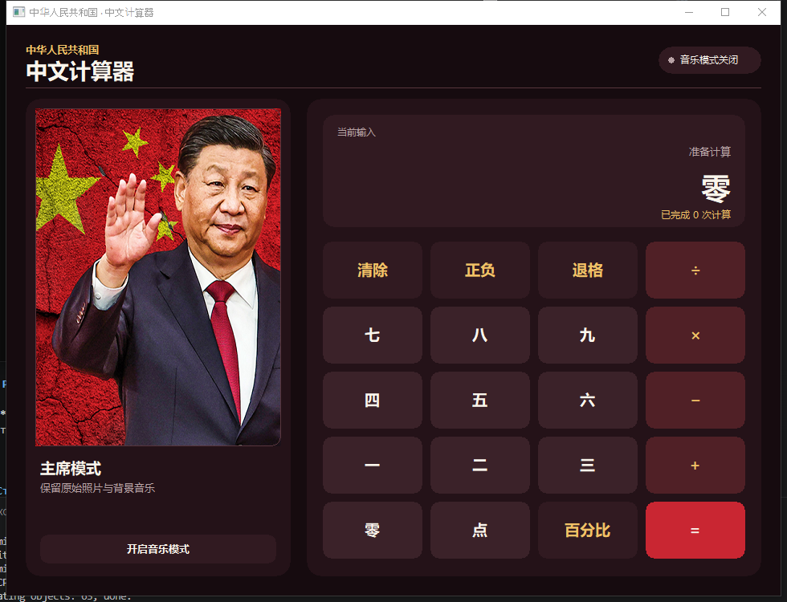
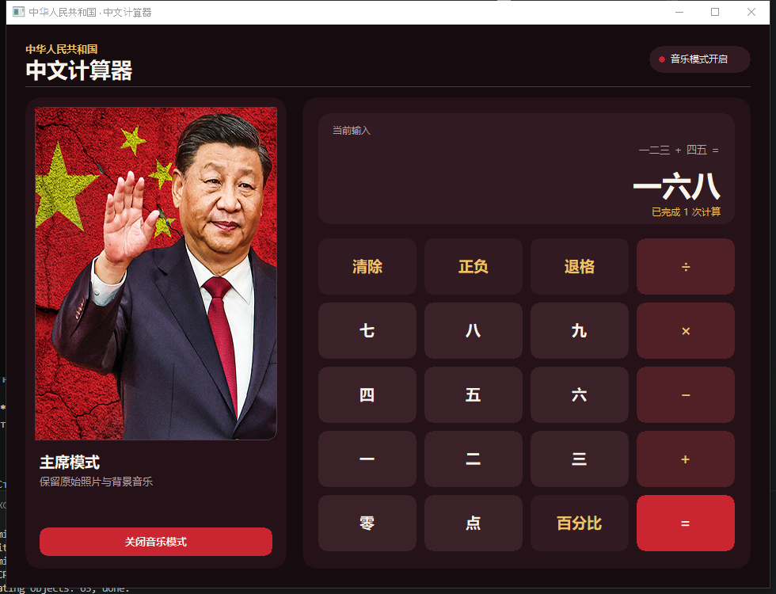

# 中华人民共和国 · 中文计算器

一款面向 Windows 的现代中文桌面计算器。界面采用深红与暖金配色，所有数字以逐位中文形式输入和显示，并保留主席照片与原有背景音乐。

当前版本：**1.2** · [下载最新发布包](https://github.com/ashtray01/CPP-calc/releases/latest)



## 主要特点

- 全新自绘界面，不再使用老式系统按钮外观
- 支持加、减、乘、除、百分比和正负号
- 支持中文小数，例如 `三点五`
- 计算结果可以直接参与下一次运算
- 支持鼠标、主键盘和数字小键盘
- 主席照片始终展示，音乐模式可以随时开启或关闭
- 照片与音乐通过 `embed.FS` 编译进可执行文件
- 支持高分屏缩放和窗口居中

## 工作状态

下图展示了 `一二三 ＋ 四五 ＝ 一六八` 的计算结果，同时开启了音乐模式。



## 快速开始

### 运行已编译版本

```powershell
.\dist\CPP-calc.exe
```

### 从源代码构建

环境要求：Windows、Go 1.26.1 或更高版本，以及可用的 CGO 工具链。

```powershell
go build -buildvcs=false -ldflags="-H=windowsgui" -o .\dist\CPP-calc.exe .\cmd\calculator
.\dist\CPP-calc.exe
```

## 操作说明

| 按钮 | 功能 |
| --- | --- |
| `零` 至 `九` | 输入中文数字 |
| `点` | 输入小数点 |
| `＋` `−` `×` `÷` | 选择运算符 |
| `＝` | 计算结果 |
| `正负` | 切换当前数字的正负号 |
| `百分比` | 将当前数字除以 100 |
| `退格` | 删除最后一个字符 |
| `清除` | 重置当前运算 |
| `开启音乐模式` | 播放原有背景音乐并切换模式状态 |

### 键盘快捷键

| 按键 | 功能 |
| --- | --- |
| `0`–`9` | 输入数字并自动显示为中文 |
| `+` `-` `*` `/` | 选择运算符 |
| `Enter` | 计算结果 |
| `Backspace` | 退格 |
| `Escape` | 清除 |
| `.` | 输入小数点 |

## 中文数字规则

本项目采用逐位显示方式，而不是传统中文数词写法：

```text
123     → 一二三
-0.25   → 负零点二五
123+45  → 一二三 ＋ 四五 ＝ 一六八
```

这种规则让键盘输入、屏幕显示和计算过程保持一一对应。

## 项目结构

```text
CPP-calc/
├── assets/                 # 嵌入的主席照片与音乐
├── cmd/calculator/         # 程序入口和 Windows 资源
├── docs/                   # 实际运行截图
├── internal/audio/         # Windows MCI 音频播放
├── internal/chinese/       # 中文数字转换与测试
├── internal/ui/            # 自绘界面和计算逻辑
├── dist/CPP-calc.exe       # 已编译程序
├── go.mod
└── README.md
```

## 开发与验证

```powershell
go test -buildvcs=false ./...
go vet -buildvcs=false ./...
go build -buildvcs=false -ldflags="-H=windowsgui -s -w" -o .\dist\CPP-calc.exe .\cmd\calculator
```

当前测试覆盖整数、负数、小数、格式化和往返转换。界面截图来自实际构建后的 Windows 程序，而不是设计稿。

## 技术栈

| 模块 | 技术 |
| --- | --- |
| 桌面界面 | Go + `github.com/lxn/walk` |
| 自绘渲染 | Win32 GDI 画布 |
| 音频 | `winmm.dll` / MCI |
| 资源 | Go `embed.FS` |
| 高分屏 | `SetProcessDpiAwareness` |

## 资源说明

`assets/leader.png` 与 `assets/music.mp3` 是应用的固定资源。本次界面重构未替换主席照片，也未删除或替换原有音乐。
